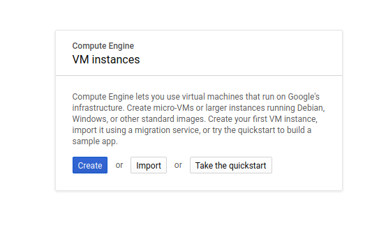

# cvat on Google Cloud

This repository will deploy a cvat instance on Google Cloud. Documentation for
setup is included in this readme.

## Setup

These steps are required if you want to setup, develop, or otherwise interact
with a Google Compute Engine instance (e.g., where we will be deploying cvat).

### 1. Request a Project

If you are a Stanford affiliate, you can request a Google Cloud Project [here](https://uit.stanford.edu/service/cloudacctmgmt) -
go to the "Getting Started" section and click on "Request a GCP Project." You
will be required to enter a PTA number (note that three fields: Project, Task, and
Award are each one of the three numbers for a PTA in the format PROJECT-TASK-AWARD)
and a primary and secondary technical contact. If you aren't a Stanford affiliate,
instructions for creating a new project are [here](https://cloud.google.com/resource-manager/docs/creating-managing-projects).

### 2. Install Gcloud

Gcloud is Google's "Google Cloud" command line tool, and it makes it easy to do
things like ssh into instances, or otherwise interact with Google Cloud
from the command line. You can [install gcloud](https://cloud.google.com/sdk/install)
and then you should be able to authenticate:

```bash
$ gcloud auth login
```

It will open your browser, and you should select the email account associated with
your new project. You can then enable your project to be default:

```bash
# gcloud config set project PROJECT_ID
$ gcloud config set project som-cvat-stanford
Updated property [core/project].
```

## Google Compute Engine

We will be deploying an instance on Google Compute Engine that has cvat installed,
following basic instructions from [opencv/cvat](https://github.com/opencv/cvat)
with additional customization to:

 - protect the instance with https
 - deploy to a custom domain

And to match the [AWS ec2-p3 instance](https://aws.amazon.com/about-aws/whats-new/2017/10/introducing-amazon-ec2-p3-instances/)
type and specs that are noted working on a lab member's machine, we will further try to choose:

 - 4 virtual cores
 - NVIDIA 1050 Ti GPU with 256GB of SSD 
 - 2TB HDD storage

Note that the ec2-p3 instance has 64 vCPUs and uses a custom Intel Xeon E5 processors, 488 GB of RAM, 
and Tesla V100 GPUs, however we will follow the wishes of the lab with respect to the specifications above (optimizing cost over performance). 

After the instance is created, the steps following could theoretically be run
from any host that also has web ports exposed and capabilities to install
the dependencies and software. These steps are discussed next in detail.

### 1. Create the Instance

Since we are deploying on Google Cloud, you will want to first log in to your project and 
[create an instance](https://console.cloud.google.com/compute/instances). 



If you want to import the [json export](scripts/gce-instance.json) of the original instance created, you
can click "import" instead of "create."  This means selecting the following:

 - **Name** is just an identifier for the instance. I chose "cvat-development"
 - **Region** For GPU support (and a better cost) you'll need to select something in us-central1.
 - **Machine Family** I typically choose General purpose, because we just need a basic linux base.
 - You don't need to select that we are deploying a container to the instance - we are, but we don't need the special "Container OS" that Google Cloud offers.
 - **Series**: For GPU support you absolutely should choose "N1."
 - **Machine Type** To match the request of the lab, we choose n1-standard-4 (4 vCPUs, 15 GB memory).
 - **Boot Disk** Since the cvat documentation mentions [18.04](https://github.com/opencv/cvat/blob/master/cvat/apps/documentation/installation.md#ubuntu-1804-x86_64amd64) for it's Linux install, we will choose Ubuntu 18.04 LTS (long term support). There is a minimal image that might work as well, although I haven't tried it. We would also want to choose 2000MB (2TB) for hard disk storage, as specified above.
 - **GPU** when you've selected a supporting zone (us-central1) and instance family (N1) You should be able to expand the "CPU Platform and GPU" dropdown to see the "Add GPU" button exposed. Since the Nvidia 1050 was not available, I chose Nvidia Tesla V100 which is reccommended for cvat with 1 GPU. I wasn't positive what cvat would need, so I selected the button to "turn on display device."
 - **API Access** you generally want to limit to only those endpoints that are needed. For the current deployment we don't need additional, however I anticipate we could use Google Storage.
 - You want to allow both http/https traffic - this server will be exposed to the web.
 - Under management, I like to enable "Delete protection." You never know if/when someone might click a button by accident.
 - Under management-> networking, you can click on the "default" interface to ensure that you have a static (and not ephemeral) ip address. This is important so that if we ever need to re-create the server, we can use the same DNS settings and have confidence that we have the ip address.

**under development - we are still discussing GPU options**

### 2. Connect to your instance

Remember installing gcloud? This will make it very easy to connect to your instance!
From the instances page you can click on "ssh" and then view the gcloud command,
and copy paste it into your terminal.
 

### 3. Install instance dependencies

cvat is run with Docker and Docker compose, so you'll need to ensure that you have both 
[Docker](https://docs.docker.com/install/) and 
[Docker Compose](https://docs.docker.com/compose/install/) installed. To make
this entire process easier, a script is provided here at [scripts/prepare_instance.sh](scripts/prepare_instance.sh)
that will:

 - install Docker
 - install docker-compose

You will still need to log out and back in after installs to ensure that your user is
added properly to the Docker group.

**under development - prepare_instance.sh will be updated with cvat dependencies**

### 4. Billing

As a precaution I always like to create billing alerts. This ensures that there aren't
any surprise charges, and I have a good awareness of the costs that my project is using.
If we calculated when we created the instance that the instance is estimated to cost
a particular amount over a month, we might set a conservative limit
of exactly that amount (if we plan to run the instance full time) or some percentage
of the monthly cost based on our expected hours with alerts at 50, 75, and 100, and adjust as needed.

### 5. Good Practices

Before you have the instance running as a service, it's generally good practice
to shut it down when you aren't working on it. This means going to the [instances](https://console.cloud.google.com/compute/instances)
console and selecting to "Stop"the instance.
